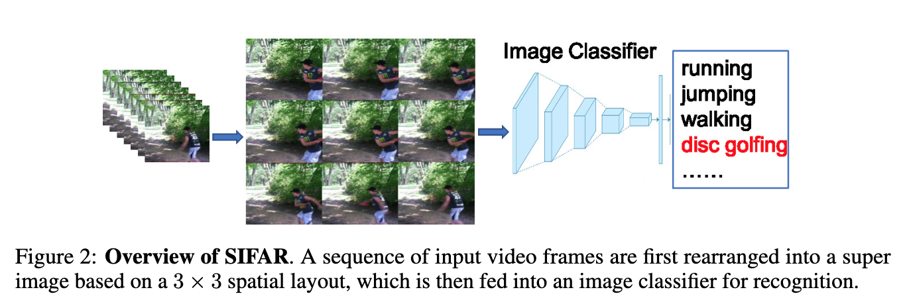

# SIFAR: Super Image for Action Recognition 

This repository contains a PyTorch implementation of SIFAR, an approach that repurposes image classifiers for efficient action recognition by rearranging input video frames into super images. 



For details please see the work, [Can An Image classifier Suffice for Action Recognition?](https://openreview.net/pdf?id=qhkFX-HLuHV) by Quanfu Fan*, Richard Chen* and Rameswar Panda*.

If you use this code for a paper please cite:

```
@INPROCEEDINGS{fan-iclr2022,
  title={Can an Image Classifier Suffice for Action Recognition?},
  author={Quanfu Fan, Richard Chen, Rameswar Panda},
  booktitle={International Conference on Learning Representations (ICLR)},
  year={2022}
}
```

# Usage

First, clone the repository locally:
```
git clone https://github.com/IBM/sifar-pytorch
```
## Requirements
```
pip install -r requirements.txt
```

To load video input, you need to install the [PyAV package](https://pyav.org/docs/develop/overview/installation.htmlgit).

# Data Preparation
Please refer to https://github.com/IBM/action-recognition-pytorch for how to prepare action recognition benchmark datasets such as Kinetics400 and Something-to-Something. For Kinetics400, we used the urls provided at [this link](https://github.com/youngwanLEE/VoV3D/blob/main/DATA.md#kinetics-400) to download the data.


## Training and Evaluation

| Model | Frames | super image| Image Size | Model Size| FLOPs (G) |
| --- | --- | --- | --- | --- | --- |
| SIFAR-B-7 (`sifar_base_patch4_window7_224`)        |  8 | 3x3 | 224 | 87 |138 |
| SIFAR-B-12 (`sifar_base_patch4_window12_192_3x3`)  |  8 | 3x3 | 192 | 87| 106 |
| SIFAR-B-14 (`sifar_base_patch4_window14_224_3x3`)  |  8 | 3x3 | 224 | 87| 147 |
| SIFAR-B-12† (`sifar_base_patch4_window12_192_4x4`) | 16 | 4x4 | 192 | 87| 189 |
| SIFAR-B-14† (`sifar_base_patch4_window12_224_4x4`) | 16 | 4x4 | 224 | 87| 263 |
| SIFAR-B-12‡ (`sifar_base_patch4_window12_192_3x3`) | 8  | 3x3 | 384 | 87| 423 |

The table above lists the configurations of different models supported by SIFAR. When training or testing a model, please make sure that the input arguments match a confiuration in the table.  

Here is an example of training a 8-frame kinetics400 model with `Uniform Sampling` on a single node with 6 GPUs,

```
 python -m torch.distributed.launch --nproc_per_node=6 main.py --data_dir [path-to-video] --use_pyav --dataset kinetics400 \
 --opt adamw --lr 1e-4 --epochs 30 --sched cosine --duration 8 --batch-size 2 --super_img_rows 3 --disable_scaleup \
 --mixup 0.8 --cutmix 1.0 --drop-path 0.1 --pretrained --warmup-epochs 5 --no-amp --model sifar_base_patch4_window14_224_3x3 \
 --output_dir [output_dir]
```
To enable position embedding, add '--hpe_to_token' to the script. 

Below is another example of fine tuning a SSV2 model using a Kinetics400 pretrain, 
```
 python -m torch.distributed.launch --nproc_per_node=6 main.py --data_dir [path-to-video] --use_pyav --dataset sth2stv2 \
 --opt adamw --lr 1e-4 --epochs 20 --sched cosine --duration 8 --batch-size 2 --super_img_rows 3 --disable_scaleup \
 --mixup 0.8 --cutmix 1.0 --drop-path 0.1 --pretrained --warmup-epochs 0 --no-amp --model sifar_base_patch4_window14_224_3x3 \
 --logdir [output_dir] --hpe_to_token --initial_checkpoint [path-to-pretrain]
```

More options for training SIFAR models can be found in `main.py`.  You can get help via
```
python3 main.py --help
```

To evaluate a model, add '--eval' to a training script and specify the path to the model to be tested by '--initial_checkpoint'. The number of crops and clips for evaluation can be set via '--num_clips' and '--num_crops'. Below is an example of running a model with 3 crops and 3 clipts,
```
 python -m torch.distributed.launch --nproc_per_node=6 main.py --data_dir [path-to-video] --use_pyav --dataset sth2stv2 \
 --opt adamw --lr 1e-4 --epochs 30 --sched cosine --duration 8 --batch-size 2 --super_img_rows 3 --disable_scaleup \
 --mixup 0.8 --cutmix 1.0 --drop-path 0.1 --pretrained --warmup-epochs 5 --no-amp --model sifar_base_patch4_window14_224_3x3 \
 --output_dir [output_dir] --hpe_to_token --initial_checkpoint [path-to-pretrain] --eval --num_crops 3 --num_clips 3
```

|Dataset| Model | Frames | Top1 | Top5 | Download |
| --- | --- | --- | --- | --- | --- |
| Kinetics400| SIFAR-B-12   |  8 | 80.0 | 94.5  | -  |
|            | SIFAR-B-12†  | 16 | 80.4 |  94.4 | - |
|            | SIFAR-B-14   | 8  | 80.2 | 94.4 | [link](https://github.com/IBM/sifar-pytorch/releases/download/action-models/sifar_base_patch4_window14_224_3x3-kinetics400_f8_pe_aug.pth)|
|            | SIFAR-B-14†  | 16 | 81.8 | 95.2 | [link](https://github.com/IBM/sifar-pytorch/releases/download/action-models/sifar_base_patch4_window14_224_4x4-kinetics400_f16_pe_aug_v1.pth) |
| SSV2     | SIFAR-B-12   |  8 | 60.8 | 87.3 | - |
|            | SIFAR-B-12†  | 16 | 61.4 | 87.6 | - |
|            | SIFAR-B-14   | 8  | 61.6 | 87.9 | [link](https://github.com/IBM/sifar-pytorch/releases/download/action-models/sifar_base_patch4_window14_224_3x3-st2stv2_kineticsft_f8_pe_aug.pth) |
|            | SIFAR-B-14†  | 16 | 62.6 | 88.5 | [link](https://github.com/IBM/sifar-pytorch/releases/download/action-models/sifar_base_patch4_window14_224_4x4-st2stv2_f16_kineticsft_pe_aug_v1.pth) |

# License
This repository is released under the appache-2.0. license as found in the [LICENSE](LICENSE) file.

